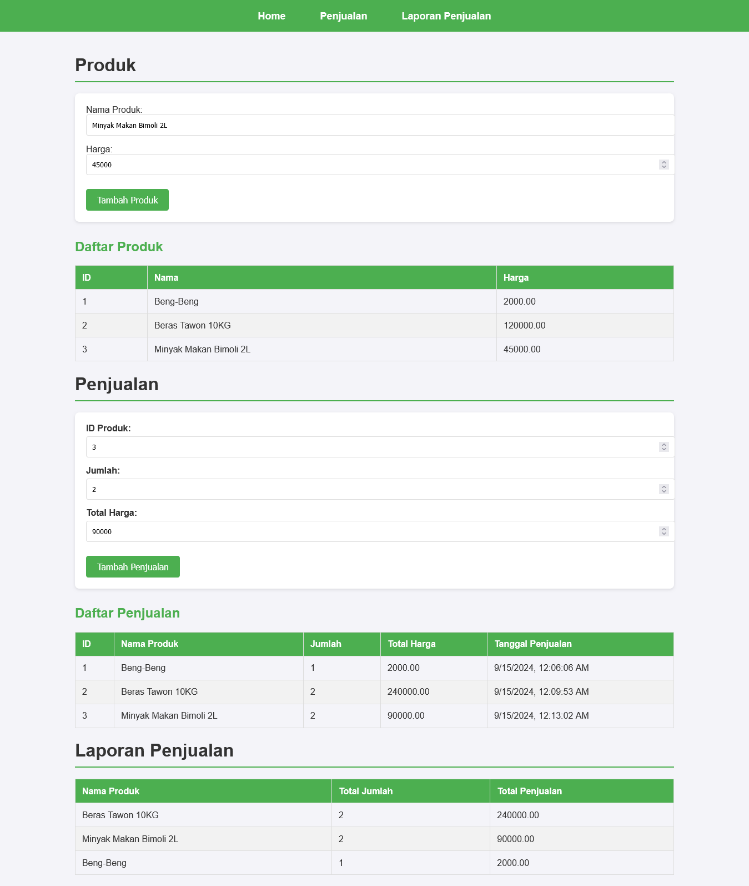

# Aplikasi Kasir

Aplikasi Laporan Penjualan adalah aplikasi berbasis web yang memungkinkan pengguna untuk mengelola penjualan di sebuah restoran atau toko. Aplikasi ini dibangun dengan Flask, Python, dan PostgreSQL. Fitur utama termasuk menambah, mengedit, dan menghapus penjualan serta melihat daftar penjualan.

## Review

Berikut adalah contoh tampilan aplikasi:

- **Homepage**



## Struktur Direktori

- `app.py`: Berisi kode utama aplikasi Flask.
- `static/`: Berisi file CSS untuk styling.
  - `style.css`: File CSS untuk styling halaman.
- `templates/`: Berisi file HTML untuk tampilan aplikasi.
  - `index.html`: Halaman utama aplikasi.

```bash
cashier_app/
│
├── app.py
├── requirements.txt
├── static/
│   └── style.css
├── templates/
│   ├── index.html
│   ├── sales.html
│   └── report.html
└── README.md
```

## Kontak

    Jika Anda memiliki pertanyaan atau saran, silakan hubungi [dimasqiramadhani@gmail.com](mailto:dimasqiramadhani@gmail.com).

